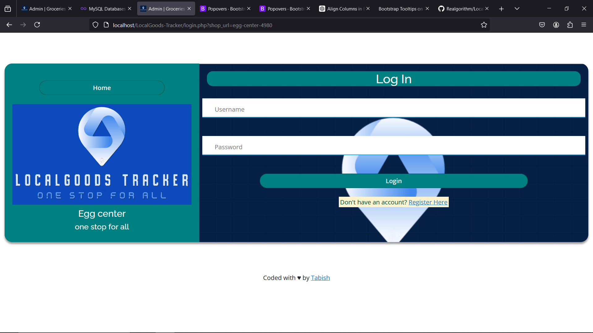

# LocalGoods-Tracker

LocalGoods-Tracker is a web application with fully responsive designed to help you track and manage local goods inventory. This project provides a simple interface for managing your shop sales, profit, and many more.


## Project Description

LocalGoods-Tracker allows users to:
- Track total sales
- Monitor total profit
- inventory details
- Track total sales
- Monitor total profit
- Stock Details
- And many more



## Dark mode 


## Light mode 


## Prerequisites

- [XAMPP](https://www.apachefriends.org/index.html) (A free and open-source cross-platform web server solution stack package)

## Installation Guide

### Step 1: Install XAMPP

1. **Download XAMPP:**
   - Go to the [XAMPP download page](https://www.apachefriends.org/index.html).
   - Download the version suitable for your operating system.

2. **Install XAMPP:**
   - Run the installer you downloaded.
   - Follow the on-screen instructions to complete the installation.
   - Start the XAMPP Control Panel and start the `Apache` and `MySQL` modules.

### Step 2: Clone the Repository

1. **Clone the Repository:**
   - Open a terminal or command prompt.
   - Navigate to the `htdocs` directory of your XAMPP installation. The default path is usually `C:\xampp\htdocs` on Windows.
   - Run the following command to clone the repository:

     ```bash
     git clone https://github.com/Realgorithm/sales_inventory_3.git
     ```

2. **Navigate to the Project Directory:**
   - After cloning, navigate to the project directory:

     ```bash
     cd sales_inventory_3
     ```

### Step 3: Setup the Database

1. **Create the Database:**
   - Open your web browser and go to [http://localhost/phpmyadmin](http://localhost/phpmyadmin).
   - Click on the `New` button to create a new database.
   - Name the database `central_db`.

2. **Import the Database:**
   - With the `central_db` database selected, click on the `Import` tab.
   - Click on the `Choose File` button and navigate to the `database` folder in the cloned repository.
   - Select the database file (e.g., `central_db.sql`) and click `Go` to import the database schema and data.

### Step 4: Configure the Application

1. **Database Configuration:**
   - Open the `db_connect.php` file located in the root directory of the cloned repository.
   - Update the database connection settings with your local environment details (if different):

     ```php
     <?php
     $conn = new mysqli('localhost', 'root', '');

     $conn = new mysqli('localhost', 'root', '') or die("Could not connect to mysql" . mysqli_error($con));

     ?>
     ```

### Step 5: Run the Application

1. **Access the Application:**
   - Open your web browser and navigate to [http://localhost/sales_inventory_3](http://localhost/sales_invertory_3).
   - You should see the LocalGoods-Tracker homepage.

## Additional Notes

- Ensure that the `Apache` and `MySQL` modules are running in the XAMPP Control Panel whenever you want to access the application.
- For any issues or bugs, please create an issue in the [GitHub repository](https://github.com/Realgorithm/sales_inventory_3/issues).

## License

This project is licensed under the MIT License - see the [LICENSE](LICENSE) file for details.

## Contact

For any questions or suggestions, please contact the project maintainer at [hussaintabish0618@gmail.com](mailto:hussaintabish0618@gmail.com).
